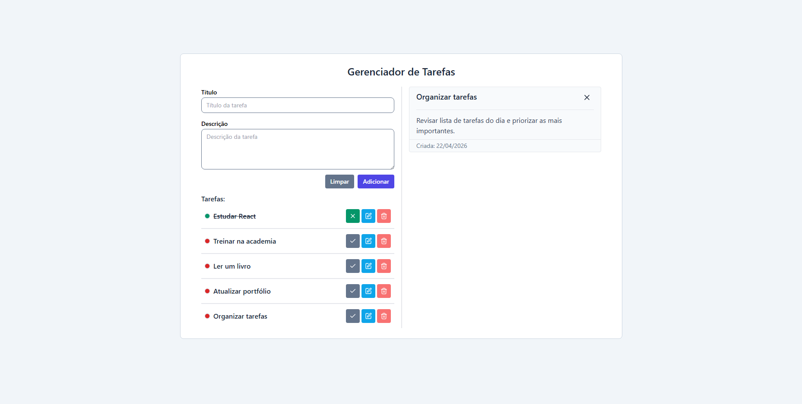

# Simple Todo List (React)

Uma aplicação simples de gerenciamento de tarefas desenvolvida com React, com funcionalidades completas de CRUD e persistência local.

---

## Demonstração



---

## Funcionalidades

- Adicionar novas tarefas
- Editar tarefas existentes
- Deletar tarefas
- Marcar/desmarcar como concluída
- Visualizar detalhes da tarefa
- Persistência de dados com `localStorage`
- Atualização automática da interface

---

## Tecnologias utilizadas

- React (Hooks)
- JavaScript (ES6+)
- TailwindCSS
- Lucide React (ícones)
- LocalStorage (persistência)

---

## Conceitos aplicados

Este projeto foi desenvolvido com foco em prática de conceitos fundamentais do React:

- Gerenciamento de estado com `useState`
- Efeitos colaterais com `useEffect`
- Imutabilidade de dados
- Componentização
- Manipulação de eventos
- Persistência de dados no browser
- Controle de formulários (controlled components)

---

## Estrutura do projeto

```
src/
├── components/
│   ├── ui/
│   ├── task/
├── App.jsx
├── main.jsx
```

---

## Como executar o projeto

```bash
# Clone o repositório
git clone https://github.com/dougl-dias/react-simple-todo-list.git

# Acesse a pasta
cd simple-todo-list

# Instale as dependências
npm install

# Rode o projeto
npm run dev
```
